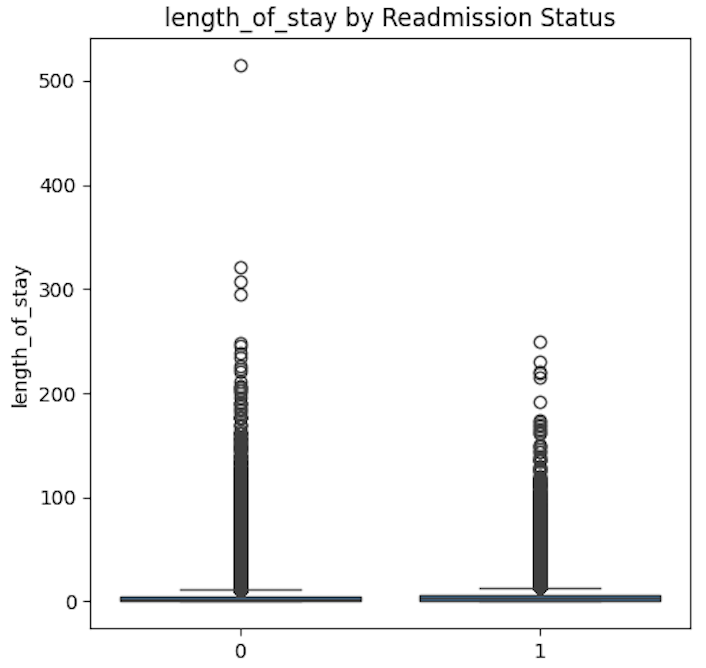
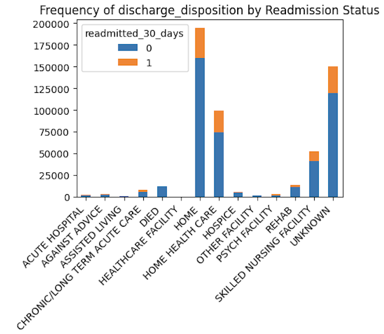
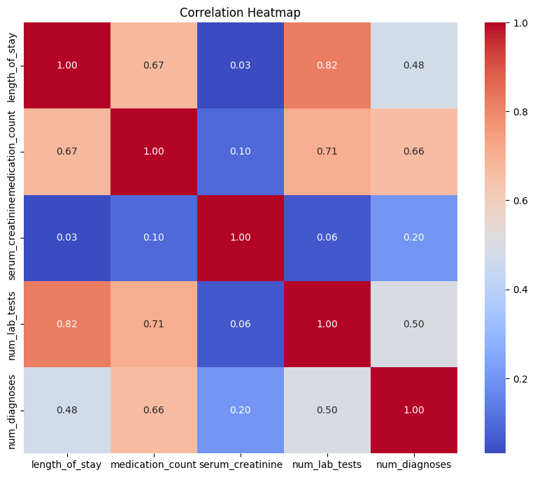

Here is the **README.md** file for the project, encapsulating the key findings, structure, and relevant visuals.

---

# Predictive Indicators for 30-Day Hospital Readmission  

## Project Overview  

This project analyzes 30-day hospital readmissions using the **MIMIC-IV** database to identify significant predictors of readmission risk. Leveraging exploratory data analysis, statistical modeling, and visualizations, the study provides actionable insights to improve patient care and reduce avoidable readmissions.

---

## Objectives  

1. **Identify significant predictors** of 30-day hospital readmissions.  
2. **Quantify the associations** between predictors and readmission risk using logistic regression.  
3. **Provide actionable insights** for clinicians, administrators, and policymakers.  

---

## Key Findings  

- **Prevalence**: 20.34% of hospital admissions resulted in 30-day readmissions.  
- **Significant Predictors**:  
   - **Charlson Comorbidity Index (CCI)**: Higher scores (e.g., CCI ≥6) significantly increase readmission odds.  
   - **Discharge Disposition**: Patients discharged to psychiatric facilities (OR = 4.75) or against medical advice (OR = 1.82) had the highest readmission risks.  
   - **Prior Admissions**: Patients with ≥5 prior admissions had a 3x higher risk of readmission.  
   - **Serum Creatinine**: Elevated levels (OR = 1.03) were associated with increased readmission risk.  

- **Protective Factors**:  
   - Discharge to **hospice** (OR = 0.43) or **rehabilitation** reduced readmission odds.  
   - Lower CCI scores and no prior admissions showed protective effects.  

- **Unexpected Findings**: Patients using **ventilation** had lower odds of readmission (OR = 0.68), possibly due to intensive care management or survivorship bias.  

---

## Visualizations  

### Length of Stay and Medication Count Distributions  
  
*Patients readmitted within 30 days tend to have longer hospital stays and higher medication counts.*  

### Discharge Disposition Impact  
  
*Discharge to psychiatric facilities or against medical advice significantly increases readmission risks.*  

### Heatmap of Predictors  
  
*Length of stay, medication count, and diagnoses exhibit strong positive correlations.*  

---

## Methodology  

1. **Data Source**: MIMIC-IV database.  
2. **Data Preparation**: Handling missing data, variable transformation, and standardization.  
3. **Statistical Analysis**:  
   - Descriptive Analysis  
   - Bivariate Analysis: t-tests, chi-square tests, Pearson correlations  
   - Multivariable Logistic Regression  

---

## Limitations  

- The retrospective design limits causal inferences.  
- Unmeasured confounders, such as socioeconomic status, may influence results.  
- Generalizability is limited to populations represented in the MIMIC-IV database.  

---

## Clinical Implications  

- **Targeted Interventions**: High-risk patients, such as those with elevated CCI scores or multiple prior admissions, require enhanced follow-up care.  
- **Discharge Planning**: Focus on improving transitions for patients discharged to psychiatric or skilled nursing facilities.  
- **Predictive Models**: Implementing risk prediction tools in clinical workflows can proactively identify vulnerable patients.  

---

## Future Research  

1. Include additional predictors, such as social determinants of health.  
2. Validate findings using diverse datasets.  
3. Explore the protective role of ventilation use in-depth.  
4. Use different ML modeling techniques to increase predictive scores.

---

## Author  

**Michael Koo**  

---

## Citation  

If you use this project, please cite:  
Koo, M. "Predictive Indicators for 30-Day Hospital Readmission." *MIMIC-IV Analysis* (2024).  

---

Replace the placeholder image links with actual file paths or visual URLs generated for the project. Let me know if you need help exporting visuals!
